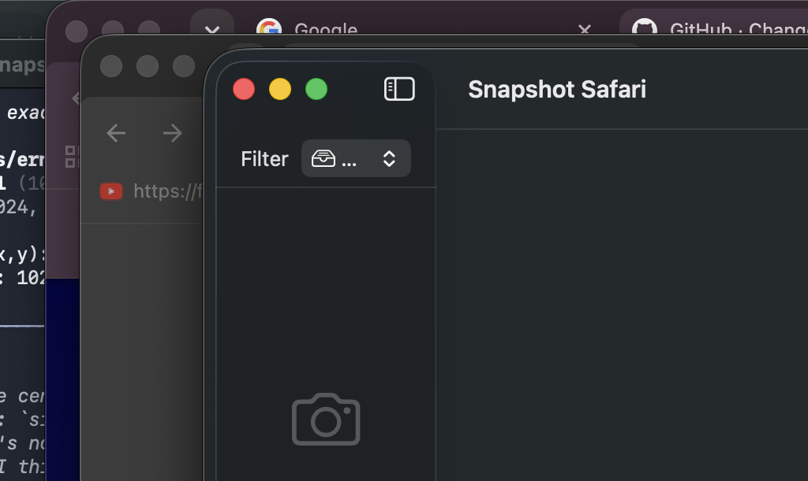
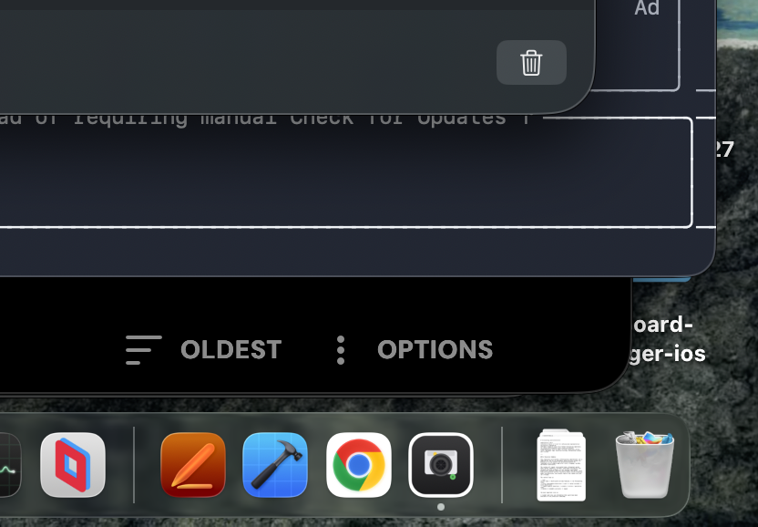
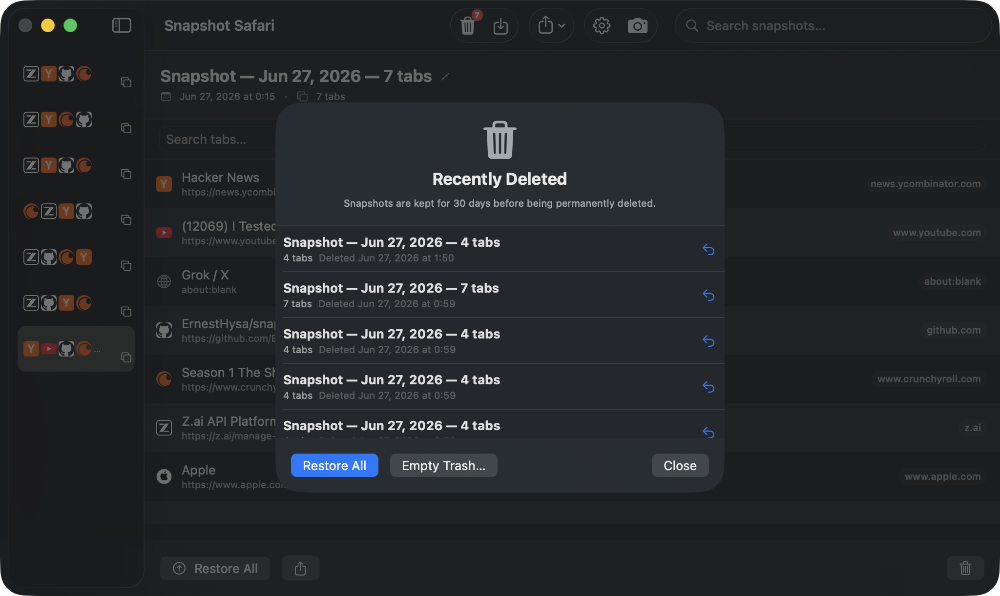
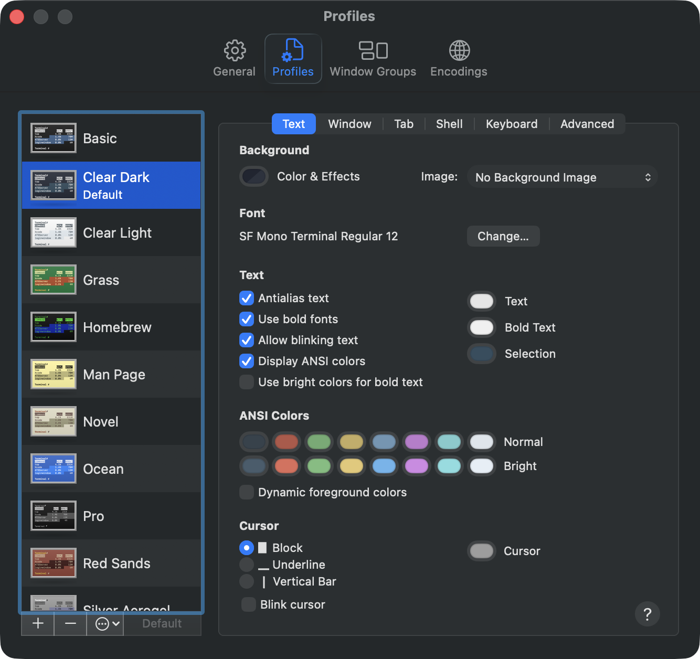

# Snapshot Safari

> Save and restore your Safari tabs — free up RAM without losing anything.

<p align="center">
  
</p>

Snapshot Safari is a native macOS app that captures all your open Safari tabs into named snapshots, lets you restore them later in new or current windows, compare changes between snapshots, and automate the process on a schedule.

Built with **SwiftUI**, **SwiftData**, and **Sparkle**.

## Features

### 📸 Snapshot Management

- **Take snapshots** of all open Safari tabs with one click (⌘N)
- **Auto-naming** — snapshots are automatically named with date, tab count, and type (manual vs. auto)
- **Search** — find snapshots by name, URL, tab title, or domain
- **Rename** — give snapshots meaningful names
- **Delete with undo** — snapshots go to trash and are auto-cleaned after 30 days
- **Export/Import** — share snapshots as JSON files (⌘E export, ⌘I import)

<p align="center">
  
</p>

### 🔄 Tab Restore

- **Restore all tabs** or select specific tabs to restore
- **Choose restore mode** — open in a new Safari window or append to the current window
- **Tab preview** — see favicons, URLs, and domains for every tab in a snapshot

### 📊 Comparison & Diffing

- **Compare two snapshots** to see what tabs were added, removed, or unchanged
- **Case-insensitive URL matching** — detects the same site regardless of URL casing
- **Visual diff** — color-coded lists with badge counts

<p align="center">
  
</p>

### ⏰ Auto-Snapshots

- **Scheduled snapshots** — automatically capture tabs every 30 min, 1h, 2h, or 4h
- **Custom intervals** — set any interval (minimum 5 minutes)
- **Persistent settings** — auto-snapshot state and interval survive app restarts
- **Silent failures** — auto-snapshots fail gracefully when Safari isn't running

### ☁️ iCloud Sync

- **Sync across Macs** — share snapshots via iCloud (requires Apple Developer Program)
- **Persistent preference** — sync toggle survives app restarts
- **Graceful fallback** — if CloudKit isn't available, the app uses local storage

### 🎨 Appearance

- **Light, Dark, and System themes** — follow your macOS preference or choose manually

<p align="center">
  
</p>

### 🔄 Auto-Updates

- **Sparkle-powered updates** — automatic update checks and downloads
- **Check for Updates** menu item in the app menu

## Requirements

- macOS 15.0 (Sequoia) or later
- Safari (for reading and restoring tabs)
- Automation permission for Safari (prompted on first launch)

## Installation

### From Source

```bash
# Clone the repository
git clone https://github.com/ErnestHysa/snapshot-safari.git
cd snapshot-safari

# Build and run
swift run

# Or open in Xcode
open Package.swift
```

### Building for Distribution

The release pipeline is split into two flavors:

**Public release** — what end users download from GitHub releases:

```bash
# Builds an ad-hoc-signed .app that launches on any Mac without a developer account.
./Scripts/build-app.sh release

# Bundle the .app into a versioned DMG with SHA256 checksum.
./Scripts/release/make-dmg.sh

# Verify the DMG: bundle structure, codesign verify (deep + strict),
# Info.plist drift check, privileged-entitlement audit, launchability test.
./Scripts/release/verify-release.sh Release/SnapshotSafari-1.0.0-1.dmg
```

The public release **does not include iCloud / CloudKit entitlements** because
those entitlements require a Developer ID signature and would cause AMFI to
SIGKILL the binary on launch if requested under ad-hoc signing. The iCloud
Sync feature is present in the code, but its toggle is disabled in Settings
for the public build and the user is shown a clear explanation.

**Signed release** — requires an Apple Developer ID ($99/yr):

```bash
export DEVELOPER_ID_APPLICATION="Developer ID Application: Your Name (TEAMID)"
./Scripts/release/sign-app.sh
./Scripts/release/make-dmg.sh
export NOTARY_PROFILE="my-profile"  # configured once via `xcrun notarytool store-credentials`
./Scripts/release/notarize-dmg.sh Release/SnapshotSafari-1.0.0-1.dmg
./Scripts/release/staple-and-verify.sh Release/SnapshotSafari-1.0.0-1.dmg
RELEASE_STRICT=1 ./Scripts/release/verify-release.sh Release/SnapshotSafari-1.0.0-1.dmg
```

**Developer build with iCloud sync** — opt-in iCloud entitlements for personal use:

```bash
ENABLE_ICLOUD_SYNC=1 ./Scripts/build-app.sh
```

The resulting .app requests iCloud / CloudKit entitlements. You must sign it
with a Developer ID (`sign-app.sh` does this) for AMFI to accept it. An
ad-hoc + iCloud entitlement binary is killed by AMFI at launch.

## Setup

### First Launch

1. Open the app — a welcome screen explains what Snapshot Safari does
2. Grant **Automation access** to Safari when prompted (System Settings → Privacy & Security → Automation)
3. Take your first snapshot with ⌘N or the camera button in the toolbar

### Sparkle Auto-Updates

Sparkle is already wired into the app (the `Sparkle` SwiftPM dependency,
`SPUStandardUpdaterController` in `SparkleUpdater.swift`, and
`SUPublicEDKey` + `SUFeedURL` in `Info.plist`). To publish a new version:

1. Bump `CFBundleShortVersionString` and `CFBundleVersion` in `Info.plist`
2. Build the new DMG: `./Scripts/release/build-release.sh && ./Scripts/release/make-dmg.sh`
3. Sign the DMG with `Sparkle/bin/sign_update` (the private key is in your macOS Keychain — generated once with `generate_keys`)
4. Update `appcast.xml` at the repo root with the new version's metadata + signature + DMG URL
5. Commit `appcast.xml`, push to `main`, create the GitHub release with the DMG asset

### iCloud Sync

iCloud Sync is fully implemented but **disabled in the public download** because
the CloudKit container + iCloud services entitlements require a Developer ID
signature — Apple Mobile File Integrity (AMFI) kills ad-hoc binaries that
request them.

The app detects at runtime whether the running binary carries the iCloud
entitlements (via `SecTaskCopyValueForEntitlement` in `SyncService.swift`)
and disables the toggle in Settings with an explanation when they are absent.

To enable iCloud sync for personal use:

1. Enroll in the [Apple Developer Program](https://developer.apple.com/programs/)
2. Create a CloudKit container with identifier `iCloud.com.ernest.snapshot-safari`
   on the [Developer Portal](https://developer.apple.com/account/resources/identifiers/container)
3. Build with iCloud entitlements: `ENABLE_ICLOUD_SYNC=1 ./Scripts/build-app.sh`
4. Sign with your Developer ID: `./Scripts/release/sign-app.sh`
5. The Settings → Sync tab will show iCloud Sync as enabled

## Usage

### Keyboard Shortcuts

| Shortcut | Action |
|----------|--------|
| ⌘N | Take a new snapshot |
| ⌘I | Import snapshots from a JSON file |
| ⌘E | Export the selected snapshot |
| ⇧⌘E | Export all snapshots |
| ⌘, | Open settings |
| ⌘⌫ | Delete the selected snapshot |
| ⌘F | Focus search field (sidebar) |
| Escape | Close sheets / dialogs |

### Taking a Snapshot

1. Make sure Safari is running with some open tabs
2. Press ⌘N or click the camera icon in the toolbar
3. The snapshot appears in the sidebar with an auto-generated name

### Restoring Tabs

1. Select a snapshot in the sidebar
2. In the detail view, click **Restore All** or select specific tabs and click **Restore Selected**
3. Choose whether to open tabs in a **New Safari Window** or the **Current Window**

### Comparing Snapshots

1. Right-click a snapshot in the sidebar
2. Choose **Compare With…** and select another snapshot
3. The comparison view shows:
   - 🟢 **Added** tabs (in the newer snapshot)
   - 🔴 **Removed** tabs (in the older snapshot)
   - ⚪ **Common** tabs (unchanged between both)

### Exporting Snapshots

1. Select a snapshot and press ⌘E (or right-click → Export…)
2. Choose a location to save the `.json` file
3. Share the file with anyone running Snapshot Safari

### Importing Snapshots

1. Press ⌘I or click the import button in the toolbar
2. Select a `.json` export file
3. The snapshots are imported and appear in the sidebar

## Architecture

### Tech Stack

| Layer | Technology |
|-------|-----------|
| UI | SwiftUI (`NavigationSplitView`, `@Observable`, `SwiftData`) |
| Persistence | SwiftData (`ModelContainer`, `@Model`, `#Predicate`) |
| Safari Integration | JXA via `osascript` (JavaScript for Automation) |
| Auto-Updates | Sparkle 2.x |
| iCloud Sync | CloudKit (via SwiftData) |
| Minimum OS | macOS 15.0 Sequoia |

### Project Structure

```
SnapshotSafari/
├── Package.swift                              # SPM manifest
├── appcast.xml                                # Sparkle update feed
├── Sources/SnapshotSafari/
│   ├── SnapshotSafariApp.swift                # App entry point, commands, CloudKit init
│   ├── Info.plist                             # Bundle metadata, Sparkle keys
│   ├── Resources/
│   │   ├── Assets.xcassets                    # App icon, colors
│   │   └── Entitlements/
│   │       ├── SnapshotSafari.entitlements       # Public build (no iCloud)
│   │       └── SnapshotSafari.entitlements.dev   # Developer build (with iCloud)
│   ├── Models/
│   │   ├── Snapshot.swift                     # SwiftData model: snapshot with tabs
│   │   ├── TabEntry.swift                     # SwiftData model: individual tab
│   │   ├── SnapshotDiff.swift                 # Diff computation between snapshots
│   │   └── SnapshotExport.swift               # Codable export/import format
│   ├── Services/
│   │   ├── SafariBridge.swift                 # JXA → Safari read/restore tabs
│   │   ├── SnapshotService.swift              # CRUD, search, trash, export/import
│   │   ├── AutoSnapshotManager.swift          # Timer-based auto-snapshot loop
│   │   ├── PermissionsService.swift           # Automation permission check
│   │   ├── SyncService.swift                  # iCloud sync state + runtime entitlement check
│   │   ├── FaviconService.swift               # Cached favicon fetching
│   │   └── SparkleUpdater.swift               # Auto-update orchestration
│   ├── ViewModels/
│   │   └── SnapshotListViewModel.swift        # Observable state for the main UI
│   ├── Utilities/
│   │   └── AutoNamer.swift                    # Smart snapshot name generation
│   └── Views/
│       ├── ContentView.swift                  # Root view: split navigation + toolbar
│       ├── SnapshotListView.swift             # Sidebar list with search
│       ├── SnapshotCard.swift                 # List item with favicon preview
│       ├── SnapshotDetailView.swift           # Tab list + restore/export/delete
│       ├── TabRow.swift                       # Individual tab row with favicon
│       ├── RestoreOptionsSheet.swift          # New/current window picker
│       ├── CompareSnapshotsView.swift         # Visual diff display
│       ├── TrashView.swift                    # Recently deleted snapshots
│       ├── SettingsView.swift                 # 7-tab settings panel
│       └── WelcomeView.swift                  # First-launch onboarding
├── Scripts/
│   ├── build-app.sh                           # swift build → .app bundle → codesign
│   └── release/
│       ├── build-release.sh                   # swift test + build-app.sh + stage
│       ├── sign-app.sh                        # Developer ID sign + Hardened Runtime
│       ├── make-dmg.sh                        # Compressed read-only DMG via hdiutil
│       ├── notarize-dmg.sh                    # notarytool submit --wait
│       ├── staple-and-verify.sh               # stapler staple + spctl + codesign
│       └── verify-release.sh                  # Bundle/codesign/entitlements/plist checks
├── scripts/
│   └── verify-release-launch.sh               # Independent launch verification
└── Tests/SnapshotSafariTests/
    ├── AutoNamerTests.swift                   # 10 naming tests
    ├── SafariBridgeTests.swift                # 18 JXA + model tests
    ├── SnapshotServiceTests.swift             # 27 CRUD, search, trash, cleanup tests
    ├── SnapshotDiffTests.swift                # 8 diff algorithm tests
    ├── SnapshotExportTests.swift              # 14 export/import tests
    └── SyncServiceTests.swift                 # 19 sync state + entitlement tests
```

### Key Design Decisions

**SwiftData for persistence** — The app uses SwiftData's `@Model` macros with an in-memory fallback container if local persistence fails. CloudKit sync is conditionally enabled via `ModelConfiguration.cloudKitDatabase`.

**JXA via osascript** — Safari tabs are read and restored using JavaScript for Automation (JXA) scripts executed through `osascript`. This approach is more reliable than AppleScript for parsing structured data (JSON output).

**Soft-delete trash** — Snapshots are soft-deleted with an `isTrashed` flag and `deletedAt` timestamp. Trashed snapshots are auto-purged after 30 days via `cleanUpOldTrash()`, called on app launch.

**URL-based diffing** — Snapshot comparison matches tabs by URL (case-insensitive), categorizing them as added, removed, or common. This is a pure function with no SwiftData dependency.

**Accessibility** — All interactive elements have `.accessibilityLabel()` and `.accessibilityHint()` for VoiceOver compatibility.

## Development

### Building

```bash
swift build
swift build -c release   # Release build
```

### Testing

```bash
# Run all tests (97 tests across 10 suites)
swift test

# Run a specific test suite
swift test --filter SnapshotServiceTests
swift test --filter SnapshotExportTests
swift test --filter SyncServiceTests
```

### Code Style

- Swift 6 with strict concurrency checking
- `@MainActor` on all services and view models that interact with SwiftData or AppKit
- `@Observable` for state management (no ObservableObject)
- Swift Testing framework (not XCTest)
- `#Predicate` for SwiftData fetch descriptors
- `@unchecked Sendable` only where absolutely necessary (NSCache, Timer workarounds)

## Test Coverage

The project includes **114 tests across 13 suites**:

| Suite | Tests | What's Covered |
|-------|-------|----------------|
| AutoNamerTests | 10 | Name prefixes, pluralization, date format, edge cases |
| SafariBridgeTests | 18 | Tab model, Codable, error messages, JXA execution |
| SnapshotServiceTests | 27 | CRUD, search (name/URL/title/domain), cascade delete, trash/restore, cleanup |
| SnapshotDiffTests | 8 | URL diffing, case-insensitivity, empty sets, many items |
| SnapshotExportTests | 14 | JSON roundtrip, version validation, service integration |
| SyncServiceTests | 19 | Default state, toggling, cloud availability, status messages, runtime iCloud entitlement detection |
| PermissionsServiceProbeTests | 4 | TCC permission probe, error handling |
| SettingsTabTests | 5 | Settings UI tabs and labels |
| RestoreModeTests | 2 | Restore mode enum |
| SafariBridgeErrorTests | 5 | Error descriptions |

## License

MIT License — see [LICENSE](LICENSE) for details.
